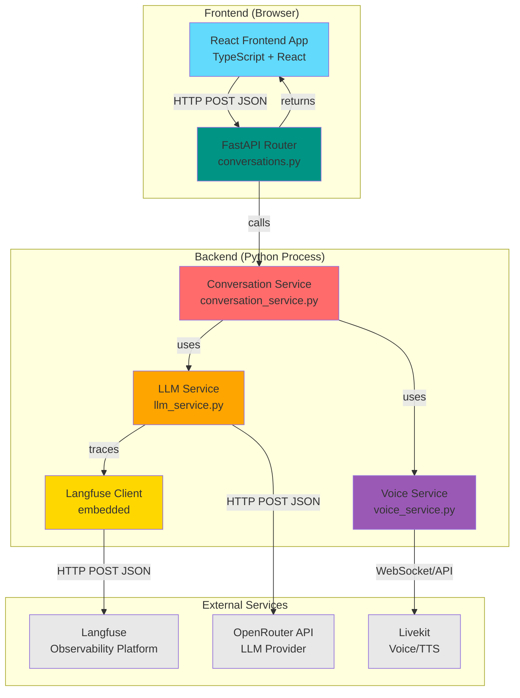

# System Overview

## 1. System Overview Diagram

## 2. Component Catalog

| Component Name | Technology/Framework | Primary Responsibility | Key Files | Heavy Logic |
|---------------|---------------------|----------------------|-----------|-------------|
| **React Frontend App** | React + TypeScript + Vite | Manages user input state, form validation, orchestrates UI components, handles API communication | `frontend/src/App.tsx`, `frontend/src/components/ScenarioForm.tsx`, `frontend/src/services/api.ts` | Complex state management for scenario data, agent configs, and conversation results; form validation logic; error handling and loading states |
| **FastAPI Router** | FastAPI + Pydantic | Handles HTTP requests, validates input schemas, routes to services, manages error responses | `backend/src/api/routes/conversations.py`, `backend/src/api/main.py` | Request validation using Pydantic models, error handling and HTTP status codes, CORS middleware configuration |
| **Conversation Service** | Python (async) | Orchestrates multi-turn conversation generation, manages agent prompts, detects conversation completion, formats scenario data | `backend/src/services/conversation_service.py` | Complex turn-by-turn conversation generation logic, alternating between dispatcher and driver agents, conversation history management, completion detection heuristics, prompt engineering and scenario formatting |
| **LLM Service** | Python (async) + httpx + Langfuse | Manages OpenRouter API calls, handles LLM requests/responses, instruments all calls with Langfuse tracing | `backend/src/services/llm_service.py` | HTTP client management with retry logic, Langfuse trace creation and generation tracking, error handling and logging, request/response transformation, metadata extraction (usage, model info) |
| **Voice Service** | Python + Livekit SDK | Integrates with Livekit for voice synthesis, converts conversation transcripts to audio files | `backend/src/services/voice_service.py` | Livekit agent orchestration, audio synthesis pipeline, conversation turn-to-audio conversion, file management |
| **Langfuse Client** | Langfuse Python SDK | Embedded observability client that tracks all LLM calls and conversations | Embedded in `llm_service.py` and `conversation_service.py` | Trace creation and management, generation tracking, metadata collection, error logging, async event submission |

## 3. Technology Stack (Quick Reference)

### UI Layer
- **React 18+** - Component framework
- **TypeScript** - Type safety
- **Vite** - Build tool and dev server
- **CSS/Tailwind** - Styling
- **Axios** - HTTP client

### State/Logic Layer
- **React Hooks** (useState, useEffect) - Client-side state management
- **TypeScript Interfaces** - Type definitions and validation

### Service/API Layer
- **FastAPI** - Web framework
- **Pydantic** - Request/response validation
- **Uvicorn** - ASGI server
- **Python 3.10+** - Runtime
- **httpx** - Async HTTP client

### Data Layer
- **In-memory** - No persistent storage (conversations generated on-demand)
- **JSON** - Data serialization format

### External Dependencies
- **OpenRouter API** - LLM provider (GPT-4, Claude, etc.)
- **Livekit** - Voice synthesis and TTS services
- **Langfuse** - LLM observability and tracing platform

## 4. Integration Points

### Frontend ↔ Backend
- **Protocol:** HTTP/HTTPS
- **Data Format:** JSON
- **Sync vs Async:** Synchronous (HTTP request/response), but backend handles async operations internally
- **Endpoints:**
  - `POST /api/v1/conversations/generate` - Generate conversation

### Backend ↔ OpenRouter API
- **Protocol:** HTTP/HTTPS
- **Data Format:** JSON (OpenAI-compatible chat completion format)
- **Sync vs Async:** Async (backend uses async/await)
- **Authentication:** Bearer token via `Authorization` header

### Backend ↔ Livekit
- **Protocol:** WebSocket + HTTP REST API
- **Data Format:** JSON + Binary audio streams
- **Sync vs Async:** Async (WebSocket-based real-time communication)
- **Authentication:** API key + secret

### Backend ↔ Langfuse
- **Protocol:** HTTP/HTTPS
- **Data Format:** JSON
- **Sync vs Async:** Async (events sent asynchronously, non-blocking)
- **Authentication:** Public key + secret key

### Internal Service Communication
- **Protocol:** Python function calls (in-process)
- **Data Format:** Python objects/dicts
- **Sync vs Async:** Async (all services use async/await pattern)

## 5. Where to Start

### To understand user interactions
- Read: `memory/system/use_cases.md` - User journeys and primary use cases
- Component: `frontend/src/App.tsx` - Main application component handling user flows

### To understand data flow
- Start with: `frontend/src/services/api.ts` - API client layer
- Then: `backend/src/api/routes/conversations.py` - Request entry point
- Then: `backend/src/services/conversation_service.py` - Core orchestration logic

### To understand business logic
- Start with: `backend/src/services/conversation_service.py` - Conversation generation orchestration
- Then: `backend/src/services/llm_service.py` - LLM interaction logic
- Then: `backend/src/services/voice_service.py` - Audio generation pipeline

### To understand observability
- Start with: `backend/src/services/llm_service.py` - Langfuse integration
- Then: Langfuse dashboard (external) - View traces and analytics

## Architecture Notes

### Key Design Patterns

1. **Service Layer Pattern** - Business logic separated into service classes (ConversationService, LLMService, VoiceService)
2. **Dependency Injection** - Services are instantiated and passed to dependents (e.g., LLMService injected into ConversationService)
3. **Async/Await** - All I/O operations are async for non-blocking performance
4. **Request/Response Models** - Pydantic models ensure type safety and validation at API boundaries
5. **Observability-First** - Langfuse tracing is embedded at the service level, not as an afterthought

### Data Flow Highlights

1. **User submits form** → Frontend validates → Sends JSON to API
2. **API receives request** → Validates with Pydantic → Routes to ConversationService
3. **ConversationService** → Formats scenario → Generates system prompts → Orchestrates multi-turn conversation
4. **Each LLM call** → LLMService creates trace → Calls OpenRouter → Logs to Langfuse → Returns response
5. **Conversation complete** → VoiceService synthesizes audio → Returns transcript + audio URL
6. **Frontend receives** → Displays transcript → Plays audio

### Critical Paths

- **Conversation Generation:** Frontend → API Router → Conversation Service → LLM Service (multiple calls) → OpenRouter API
- **Observability:** Every LLM call → Langfuse Client → Langfuse Platform (async, non-blocking)
- **Audio Generation:** Conversation Service → Voice Service → Livekit (future implementation)

### Performance Considerations

- All backend operations are async, allowing concurrent LLM calls
- Langfuse tracing is non-blocking (async submission)
- Frontend handles loading states during async operations
- No database queries (stateless, on-demand generation)

